# Harmony 插件 — 用户手册

> **读者**：在 Qt Creator 中使用本插件开发 **Qt for HarmonyOS / OpenHarmony** 应用的开发者。  
> **版本**：适用于插件 **1.0.0**，Qt Creator **19.x**。  
> **深度说明**：外部工具依赖细节见 [OPERATIONS.md](OPERATIONS.md)；架构与已知限制见 [ARCHITECTURE.md](ARCHITECTURE.md)。

---

## 目录

1. [插件安装](#1-插件安装)
2. [Harmony 插件配置](#2-harmony-插件配置)
   - 2.1 [打开 Harmony 设置页](#21-打开-harmony-设置页)
   - 2.2 [DevEco Studio 路径配置](#22-deveco-studio-路径配置)
   - 2.3 [HarmonyOS SDK 存储位置](#23-harmonyos-sdk-存储位置)
   - 2.4 [下载 OpenHarmony SDK](#24-下载-openharmony-sdk)
   - 2.5 [下载 Qt for HarmonyOS SDK](#25-下载-qt-for-harmonyos-sdk)
3. [自动注册展示](#3-自动注册展示)
   - 3.1 [OHOS 调试器自动注册](#31-ohos-调试器自动注册)
   - 3.2 [HarmonyOS 编译工具链自动注册](#32-harmonyos-编译工具链自动注册)
   - 3.3 [Qt for HarmonyOS QtVersion 自动注册](#33-qt-for-harmonyos-qtversion-自动注册)
   - 3.4 [Qt for HarmonyOS Kit 自动注册](#34-qt-for-harmonyos-kit-自动注册)
4. [新建 Qt for HarmonyOS 工程](#4-新建-qt-for-harmonyos-工程)
5. [编译 Qt for HarmonyOS 工程](#5-编译-qt-for-harmonyos-工程)
6. [签名、连接设备与部署](#6-签名连接设备与部署)
7. [应用运行](#7-应用运行)
8. [应用日志查看](#8-应用日志查看)
9. [调试 Qt for HarmonyOS 应用](#9-调试-qt-for-harmonyos-应用)

---

## 1. 插件安装

### 前提条件

在加载插件前，请确认以下环境已就绪：

| 组件 | 版本要求 | 说明 |
|------|----------|------|
| **Qt Creator** | **19.x**（与插件构建所用主版本一致） | 插件二进制与宿主 Qt Creator **主版本必须匹配** |
| **DevEco Studio** | 建议最新稳定版 | 提供 SDK、Node.js、JDK、hvigor、ohpm |
| **hdc** | DevEco 工具链自带 | 设备通信工具，位于 SDK `toolchains/` 目录下 |
| **Qt for HarmonyOS** | 由 Qt 官方或 GitCode 发布 | 通过插件内置的 SDK 管理器下载，或手动添加 |

### 加载插件

本插件以**外载插件**（out-of-tree plugin）方式加载，启动 Qt Creator 时通过 `-pluginpath` 参数指定插件所在目录：

```bash
# macOS
"/Applications/Qt Creator.app/Contents/MacOS/Qt Creator" \
    -pluginpath /path/to/plugin/dir

# Linux
./qtcreator -pluginpath /path/to/plugin/dir

# Windows（PowerShell）
& "C:\Qt\Tools\QtCreator\bin\qtcreator.exe" `
    -pluginpath "C:\path\to\plugin\dir"
```

**首次加载建议**：追加 `-temporarycleansettings`（或 `-tcs`）参数，以隔离全局用户配置，避免与已有插件设置冲突：

```bash
# macOS 示例（首次验证）
"/Applications/Qt Creator.app/Contents/MacOS/Qt Creator" \
    -pluginpath /path/to/plugin/dir \
    -temporarycleansettings
```

### 验证加载成功

启动后，依次进入 **Help → About Plugins…**，在插件列表中搜索 **Harmony**，确认插件状态为 **Loaded**，版本号与发布版本一致。

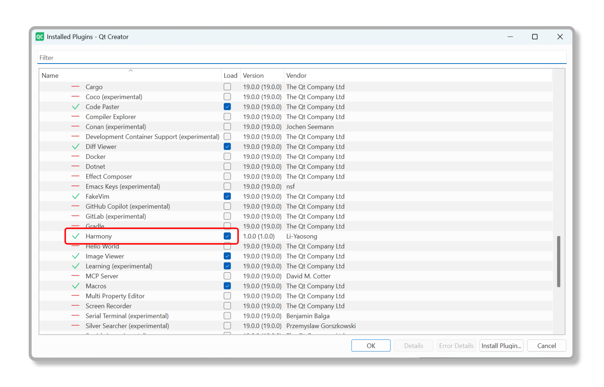

> **提示**：加载成功后，Qt Creator 菜单中将出现 **Tools → Options → Harmony**（macOS 下为 **Qt Creator → Preferences → Harmony**）配置入口；设备面板也会新增 **HarmonyOS** 设备分类。

---

## 2. Harmony 插件配置

### 2.1 打开 Harmony 设置页

依次点击：

- **Windows / Linux**：`Tools` → `Options` → 左侧列表选择 `Harmony`

- **macOS**：`Qt Creator` → `Preferences` → 左侧列表选择 `Harmony`

  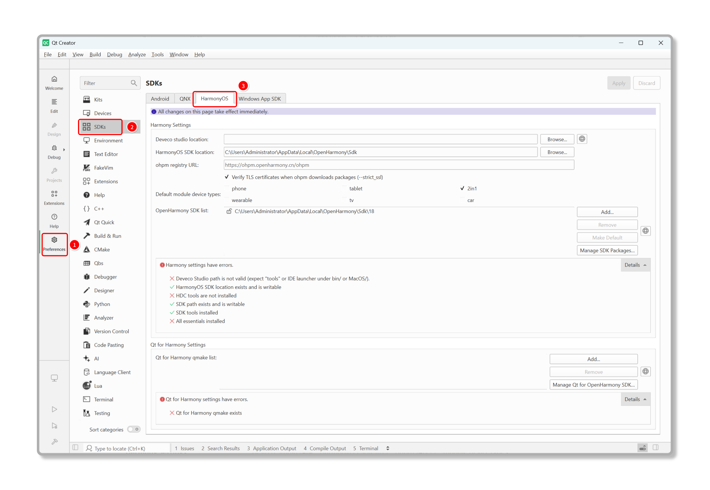

  设置页由两个分组组成：

| 分组 | 内容 |
|------|------|
| **Harmony Settings** | DevEco Studio 路径、HarmonyOS SDK 位置、ohpm 源配置、module deviceTypes |
| **Qt for Harmony Settings** | Qt for Harmony qmake 路径列表 |

页顶部有一条蓝色提示横幅：

> *All changes on this page take effect immediately.*

所有配置**实时写入**，无需手动点击 Apply 或 OK。

---

### 2.2 DevEco Studio 路径配置

#### 作用

插件通过 DevEco Studio 安装目录自动定位以下工具：

| 工具 | 用途 | 典型路径（相对 DevEco 根目录） |
|------|------|-------------------------------|
| Node.js | 执行 hvigor / ohpm 脚本 | `tools/node/bin/node`（macOS/Linux）或 `tools/node/node.exe`（Windows） |
| JDK（JBR） | hvigor Gradle 子进程 | `jbr/Contents/Home`（macOS）/ `jbr/`（Windows/Linux） |
| hvigorw.js | 工程同步与 HAP 构建 | SDK 工具链目录 |
| ohpm | 依赖安装 | SDK 工具链目录 |

#### 配置步骤

1. 在 **Harmony Settings** 分组中，找到 **Deveco studio location** 行。

2. 点击路径输入框右侧的**浏览按钮（`…`）**，在弹出的文件对话框中选择 DevEco Studio 的**安装根目录**：
   - **macOS**：选择 `DevEco-Studio.app`（`.app` 包整体，无需展开到 `Contents`）
   - **Windows**：选择 DevEco Studio 安装文件夹（例如 `C:\Program Files\Huawei\DevEco Studio`）
   - **Linux**：选择 DevEco Studio 解压目录
   
   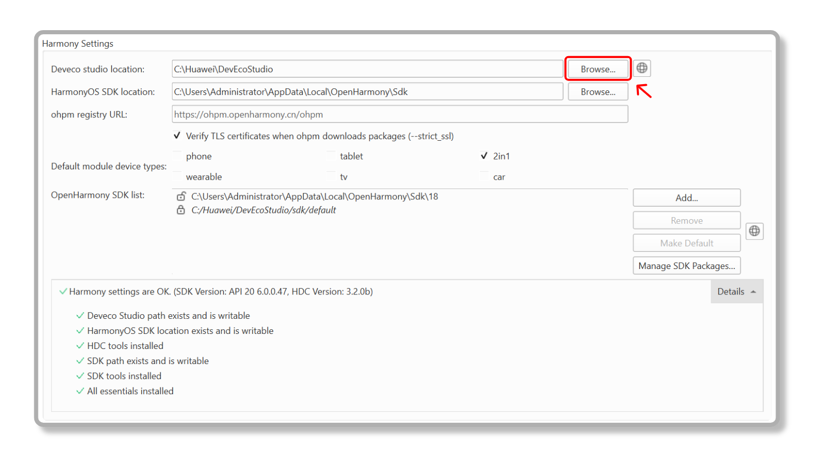
   
3. 选择后路径立即生效。底部 Summary 校验区会更新 **Deveco Studio path exists and is writable** 为绿色 ✓。

> **自动检测**：若 `DEVECO_STUDIO_HOME` 环境变量已设置，或 macOS 的 `/Applications` 下存在 `*DevEco*.app`，插件会**自动填充**此路径，无需手动选择。

#### 下载 DevEco Studio

路径框右侧有一个**下载图标按钮**（🔗），点击后会在系统浏览器中打开 DevEco Studio 官方下载页面。

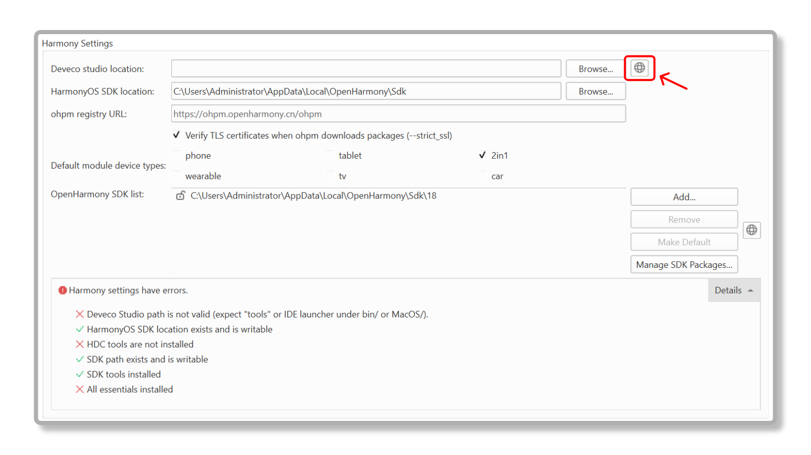

---

### 2.3 HarmonyOS SDK 存储位置

#### 作用

**HarmonyOS SDK location** 指定 SDK 管理器的根目录：

- 下载的 SDK 压缩包缓存到 `.temp/` 子目录
- 解压后的 SDK 安装到 `<API 版本>/` 子目录（如 `12/`、`13/`）
- 布局思路与 Android SDK 一致

#### 配置步骤

1. 在 **Harmony Settings** 分组中，找到 **HarmonyOS SDK location** 行。

2. 点击**浏览按钮（`…`）**，选择用于存放 SDK 的目录（建议专用空目录）。

   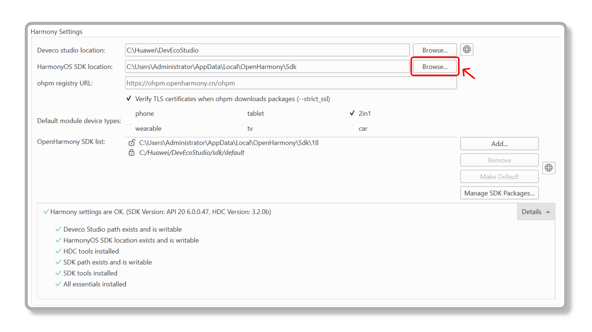

3. 若未手动设置，插件会按以下优先级自动选取默认路径：

- 环境变量 `OHOS_SDK_HOME` / `OHOS_SDK_PATH`
- macOS：`~/Library/OpenHarmony/Sdk`
- Windows：`%LOCALAPPDATA%\OpenHarmony\Sdk`
- Linux：`~/.local/share/OpenHarmony/Sdk`

---

### 2.4 下载 OpenHarmony SDK

OpenHarmony SDK 通过插件内置的 **SDK 包管理器**下载，无需手动访问网站。

#### 方式一：SDK 包管理器（推荐）

1. 在 **Harmony Settings** 分组的 **OpenHarmony SDK list** 右侧，点击 **Manage SDK Packages…** 按钮。

   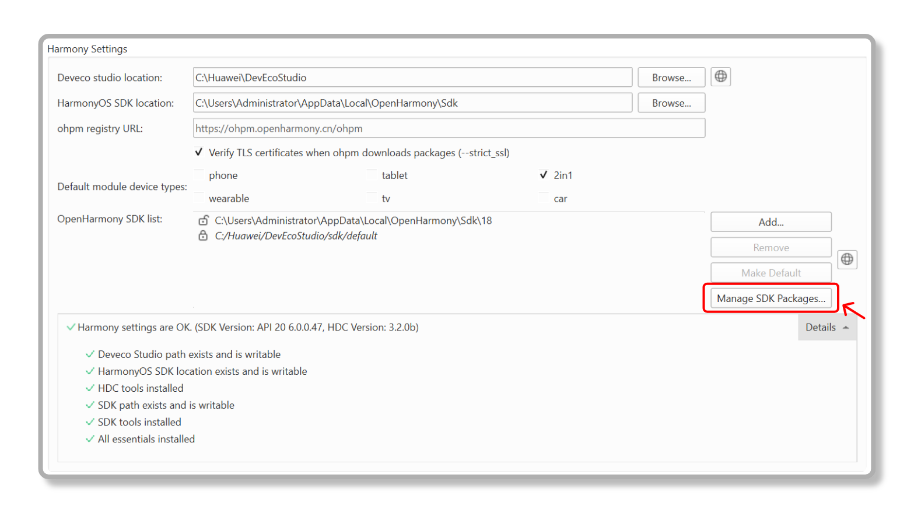

2. 弹出 **OpenHarmony SDK 管理器**对话框，显示官方包索引的可用 API 版本列表。

   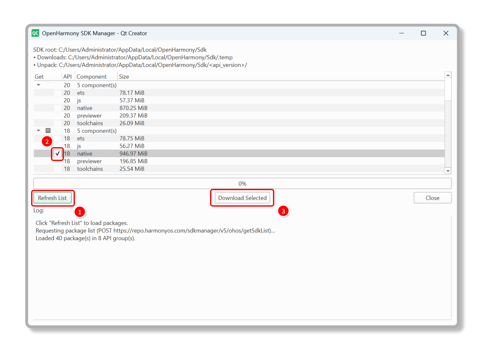

3. 勾选需要安装的 API 版本，点击 **Download / Install**。

4. 下载完成后，SDK 路径会自动添加到 **OpenHarmony SDK list** 中，工具链同步触发注册。

#### 方式二：手动添加已有 SDK

若本地已通过 DevEco Studio 安装了 SDK：

1. 在 **OpenHarmony SDK list** 旁点击 **Add…** 按钮。

   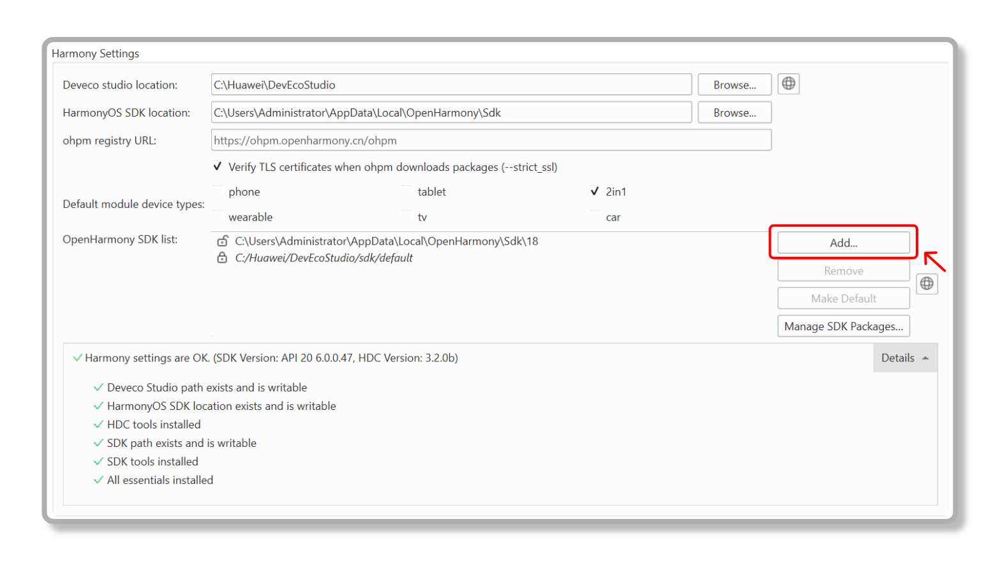

2. 选择包含 `native/`、`toolchains/` 等子目录的 **SDK 根目录**（通常是 `<SDK 根目录>/<API 版本>/`，如 `.../OpenHarmony/12/`）。

3. 插件自动校验该路径（检查 `native/oh-uni-package.json` 等标识文件）：
   - 校验通过：显示在列表中，工具链自动注册
   - 校验失败：底部 Summary 区显示红色 ✗ 错误提示

#### 设置默认 SDK

选中列表中某个 SDK 条目，点击 **Make Default** 将其设为默认（工具链自动创建的基准版本）。

> **Summary 校验项**（底部展开的 Details 区）：
> - **Deveco Studio path exists and is writable**
> - **HarmonyOS SDK location exists and is writable**
> - **HDC tools installed** — `toolchains/hdc` 可执行文件存在
> - **SDK path exists and is writable**
> - **SDK tools installed** — `native/` 等核心目录存在
> - **All essentials installed** — 以上全部通过

---

### 2.5 下载 Qt for HarmonyOS SDK

Qt for HarmonyOS SDK（含 `qmake`、Qt 库、头文件）通过独立的 **Qt for OH SDK 管理器**下载。

#### 方式一：Qt for OH SDK 管理器（推荐）

1. 在 **Qt for Harmony Settings** 分组中，点击 **Manage Qt for OpenHarmony SDK…** 按钮。

   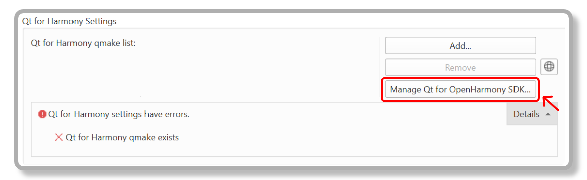

2. 弹出 **Qt for OpenHarmony SDK 管理器**对话框，显示来自在线 Binary Catalog JSON 的可用版本列表（发布源：GitCode）。

   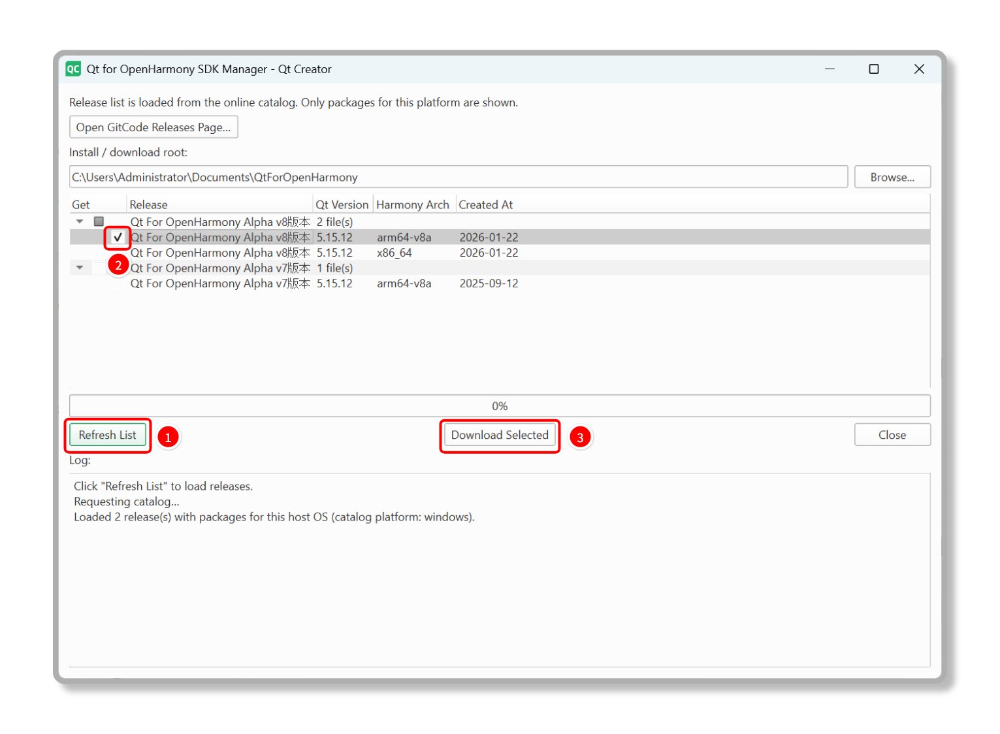

3. 选择目标 Qt 版本与 ABI，点击 **Download**。

4. 下载并解压完成后，对应的 `qmake` 路径会**自动添加**到 **Qt for Harmony qmake list**，并触发工具链与 Kit 同步。

   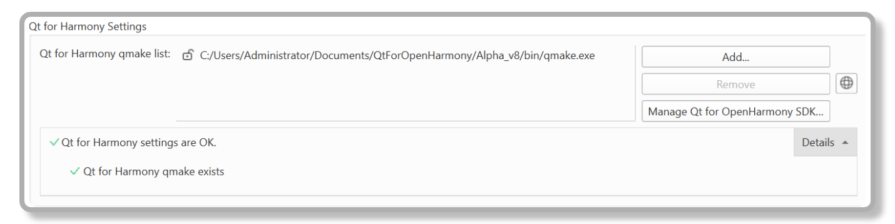

#### 方式二：手动添加已有 qmake

若已从其他渠道获取了 Qt for HarmonyOS 预编译包：

1. 在 **Qt for Harmony Settings** 分组中，点击 **Add…** 按钮。

   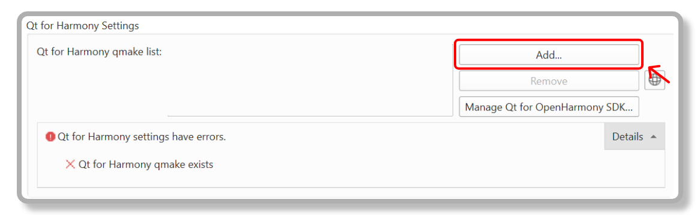

2. 选择 Qt for HarmonyOS 的 **`qmake` 可执行文件**（Windows 为 `qmake.exe`，其他平台为 `qmake`）。

3. 插件自动解析 `qconfig.h` 与 `qdevice.pri` 读取 ABI 与 OH SDK 版本，**Qt for Harmony settings are OK.** Summary 行显示校验结果。

  保存后插件立即触发工具链、Qt 版本和 Kit 的同步更新，无需重启 Qt Creator。

---

## 3. 自动注册展示

完成 [第 2 节](#2-harmony-插件配置) 的配置后，插件会**自动**完成以下注册，用户无需手动操作。

### 3.1 OHOS 调试器自动注册

插件通过 `HarmonyDebugWorkerFactory` 注册针对 HarmonyOS 设备的 LLDB 调试工厂。

**验证方式**：进入 `Tools → Options → Kits → Debuggers`，可看到系统 LLDB 调试器。调试器无需单独配置；插件在调试启动时自动：

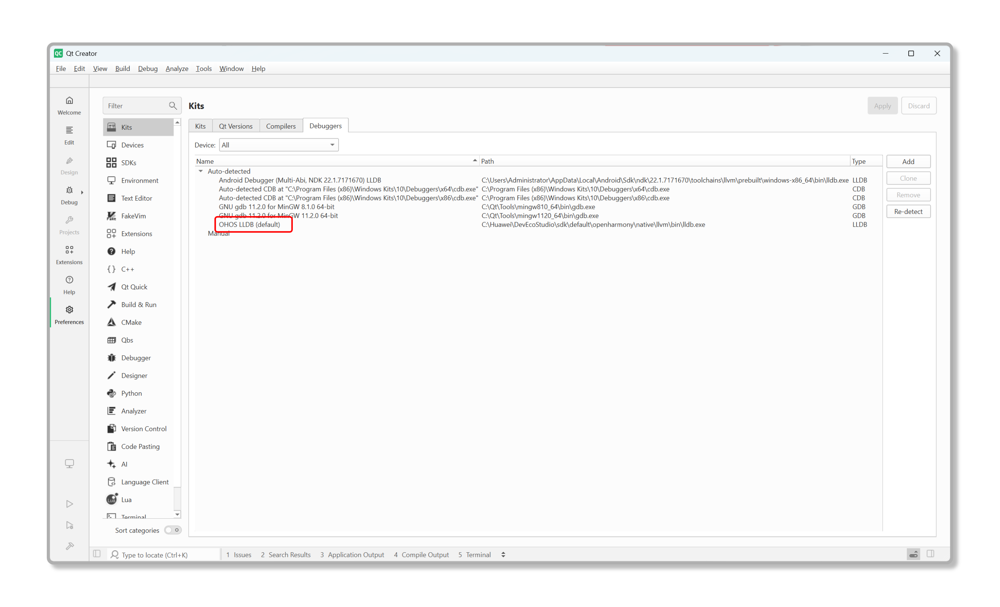

1. 从 DevEco SDK 路径定位适配目标 ABI 的 `lldb-server`
   - 路径：`<DevEco>/sdk/default/openharmony/native/llvm/lib/clang/<ver>/bin/<triple>/lldb-server`
2. 将 `lldb-server` 推送到设备 `/data/local/tmp/debugserver/<bundle>/`
3. 设置 LLDB platform 为 `remote-ohos` 并通过 Unix Abstract Socket 连接

---

### 3.2 HarmonyOS 编译工具链自动注册

添加有效的 OpenHarmony SDK 后，插件自动扫描 `<SDK>/native/llvm/bin/` 并注册以下工具链：

| 工具链名称（示例） | 编译器 | 目标 ABI |
|-------------------|--------|----------|
| `OHOS Clang (aarch64)` | `aarch64-linux-ohos-clang` | arm64-v8a |
| `OHOS Clang++ (aarch64)` | `aarch64-linux-ohos-clang++` | arm64-v8a |
| `OHOS Clang (x86_64)` | `x86_64-linux-ohos-clang` | x86_64 |
| `OHOS Clang++ (x86_64)` | `x86_64-linux-ohos-clang++` | x86_64 |

**验证方式**：进入 `Tools → Options → Kits → Compilers`，筛选类型 **OHOS Clang**，可见自动检测的工具链条目，状态为 **Auto-detected**。

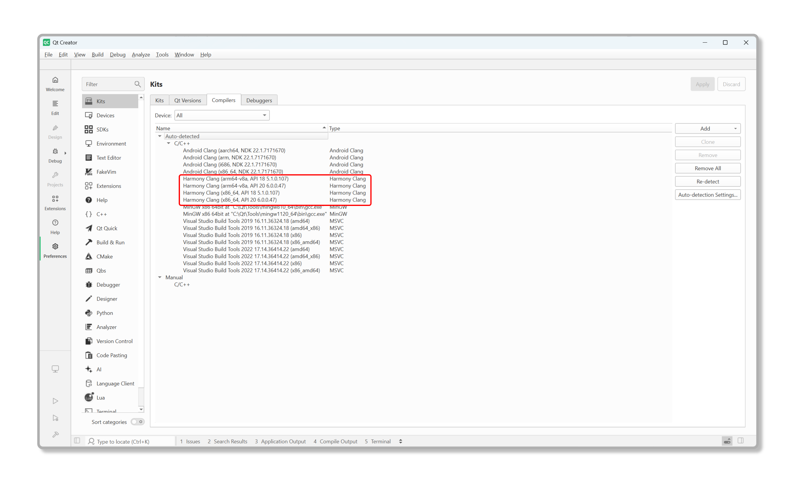

> 工具链条目为只读。若 NDK 路径变更（如更新 SDK），请在 Harmony 设置页移除旧 SDK 并重新添加，插件会自动清理旧工具链并注册新版本。

---

### 3.3 Qt for HarmonyOS QtVersion 自动注册

添加 qmake 后，插件通过 `HarmonyQtVersionFactory` 将其识别为 **HarmonyOS** 类型 Qt 版本，并读取：

| 信息字段 | 来源文件 | 说明 |
|----------|----------|------|
| 目标 ABI | `mkspecs/qdevice.pri` 中的 `OHOS_ARCH=` | 如 `aarch64-linux-ohos` → arm64 |
| OH SDK 版本 | `include/QtCore/qconfig.h` 中的 `OHOS_SDK_VERSION` | 与 SDK API 版本对应 |
| 多 ABI 支持 | `qtAbis().size() > 1` | 随 qmake 元数据自动判定 |

**验证方式**：进入 `Tools → Options → Kits → Qt Versions`，可见已注册的 Qt for HarmonyOS 版本，显示名称格式为 `Qt <版本> for HarmonyOS (<ABI>)`。

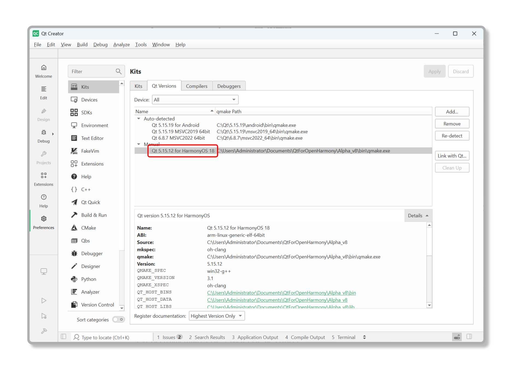

---

### 3.4 Qt for HarmonyOS Kit 自动注册

Qt Version 注册成功后，插件的 `updateAutomaticKitList()` 会自动为每个 Qt for HarmonyOS 版本创建对应的 **Kit（构建套件）**：

| Kit 字段 | 自动填充内容 |
|----------|-------------|
| **名称** | `Qt <版本> for HarmonyOS (<ABI>)` |
| **编译器（C）** | 与 ABI 匹配的 OHOS Clang |
| **编译器（C++）** | 与 ABI 匹配的 OHOS Clang++ |
| **Qt 版本** | 对应的 `HarmonyQtVersion` |
| **设备类型** | `HarmonyOS Device` |
| **CMake 工具链文件** | `<SDK>/native/build/cmake/ohos.toolchain.cmake` |
| **OHOS_ARCH** | 由 ABI 推导，如 `arm64-v8a` |
| **module deviceTypes** | 来自 Harmony 设置页的默认值（如 `phone,tablet,2in1`） |

**验证方式**：进入 `Tools → Options → Kits`，可见标记为 **Auto-detected**、设备类型为 **HarmonyOS Device** 的 Kit 条目。工程打开后，在 **Projects → Build** 的 **Harmony 摘要子页**中可查看只读信息（Qt 版本、NDK 路径、`OHOS_ARCH`、工具链文件）。

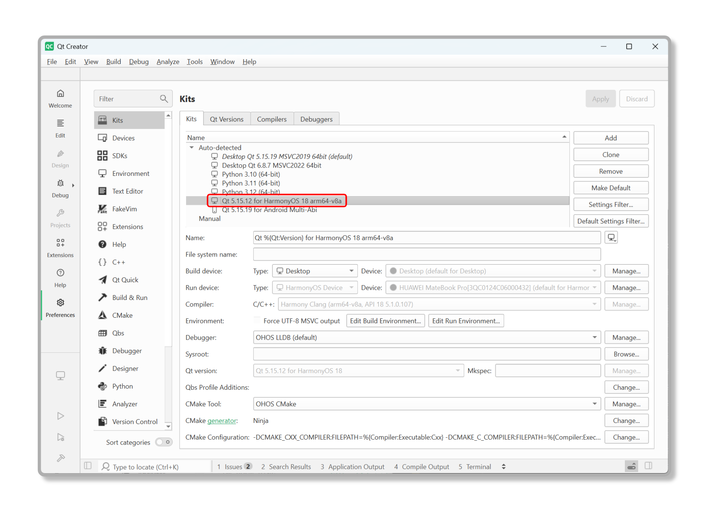

> **InfoBar 引导**：若检测到已注册 Harmony Qt 但无有效 SDK，或已有有效 SDK 但未注册任何 Harmony Qt，主界面顶部会出现**蓝色信息栏**，点击可直接跳转至 Harmony 设置页。

---

## 4. 新建 Qt for HarmonyOS 工程

插件安装后会自动将 HarmonyOS 支持注入到 Qt Creator 内置的 **Qt Widgets Application** 向导模板，可以直接通过新建工程向导创建一个可部署到 HarmonyOS 设备的 Qt 工程。

### 新建工程步骤

1. 点击菜单 `File → New Project…`（快捷键 **Ctrl+N** / macOS **⌘N**）。

2. 在弹出的向导中，选择 `Application (Qt)` → **Qt Widgets Application**，点击 **Choose…**。

   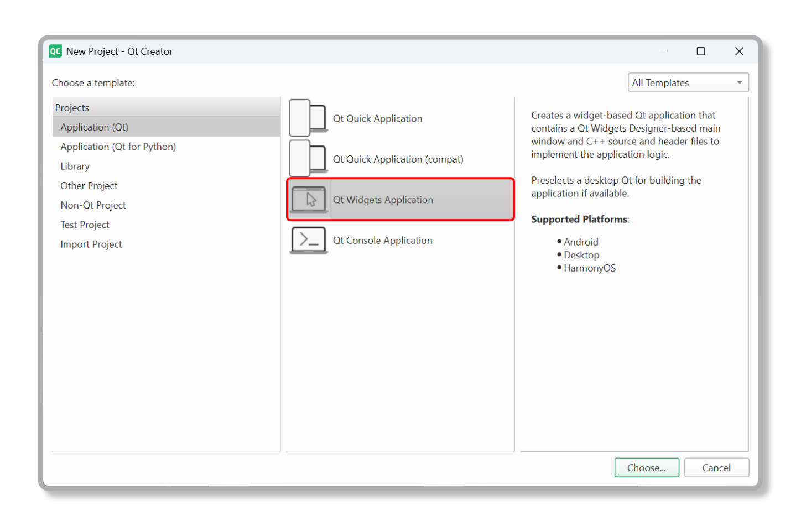

3. 填写工程信息：
   - **Name**：工程名称（建议仅含英文字母、数字和下划线）

   - **Create in**：工程存放目录（建议路径不含中文或空格）

     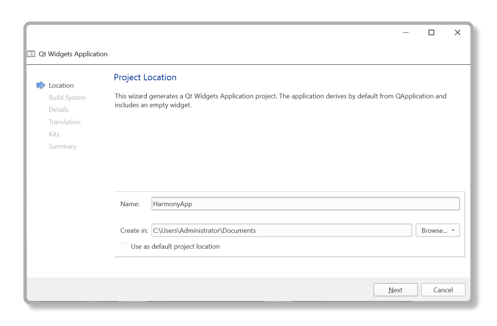

4. 在 **Build System** 选择页，选择 **CMake with Qt 5 Compatibility**。

   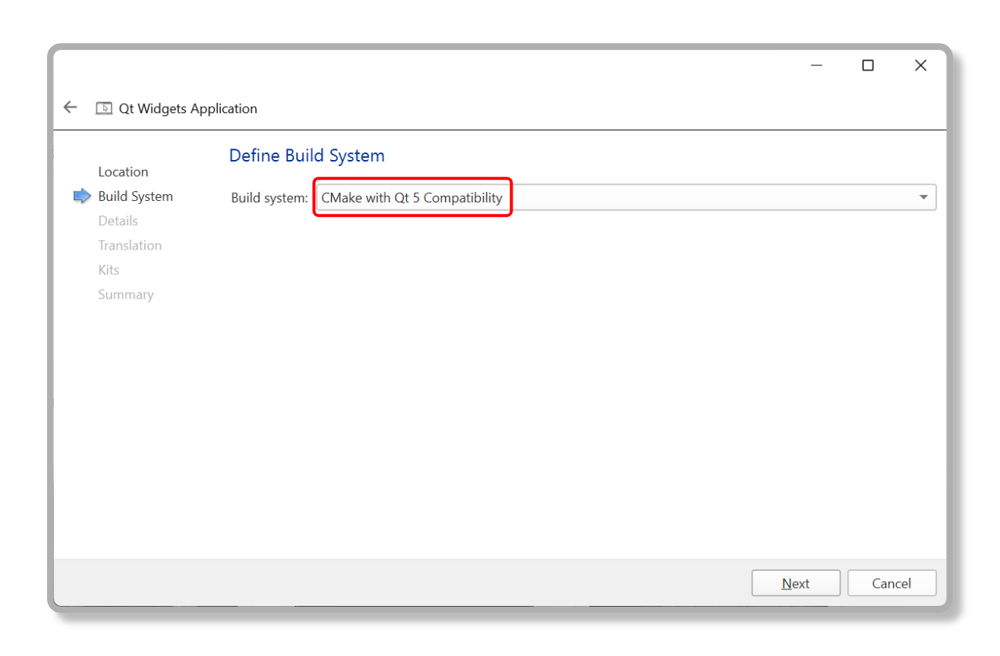

5. 在 **Kit Selection** 页：
   - 勾选 [第 3.4 节](#34-qt-for-harmonyos-kit-自动注册) 中自动注册的 **HarmonyOS Kit**（名称格式：`Qt <版本> for HarmonyOS (arm64-v8a)`）

     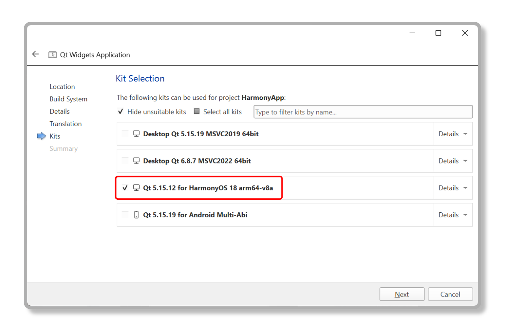

   - 可同时保留 Desktop Kit，以便在宿主机快速验证 UI

6. 完成向导，Qt Creator 自动生成带有 HarmonyOS 适配的 `CMakeLists.txt`，并完成 CMake 配置。

   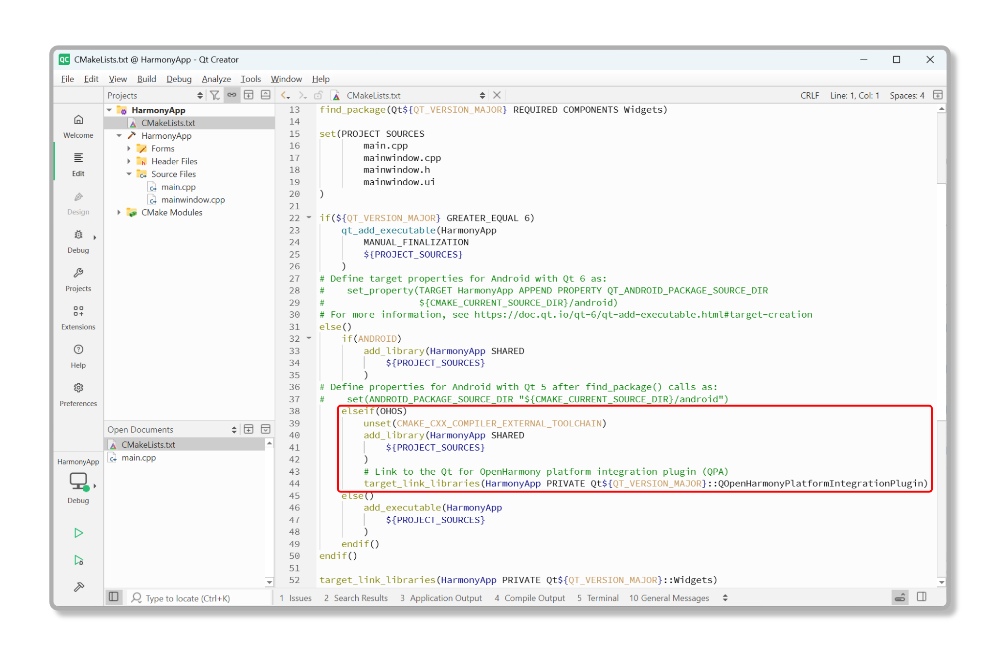

> **模板说明**：插件在构建/安装时将 `share/templates/projects/qtwidgetsapplication/CMakeLists.txt` 覆盖到 Qt Creator 的向导目录，新增了 `OHOS` 平台分支——自动以 `add_library(... SHARED)` 代替 `add_executable`，并链接 `Qt::QOpenHarmonyPlatformIntegrationPlugin` QPA 插件，HarmonyOS 工程开箱即用，无需手动修改 CMakeLists.txt。

### 配置完成后

工程打开后，切换到 HarmonyOS Kit，在左侧 **Projects** 面板 → **Build & Run** → **Build** 页的 **Harmony** 子页中，可查看当前 Kit 的只读摘要（Qt 版本、NDK 路径、`OHOS_ARCH`、CMake 工具链文件等）。

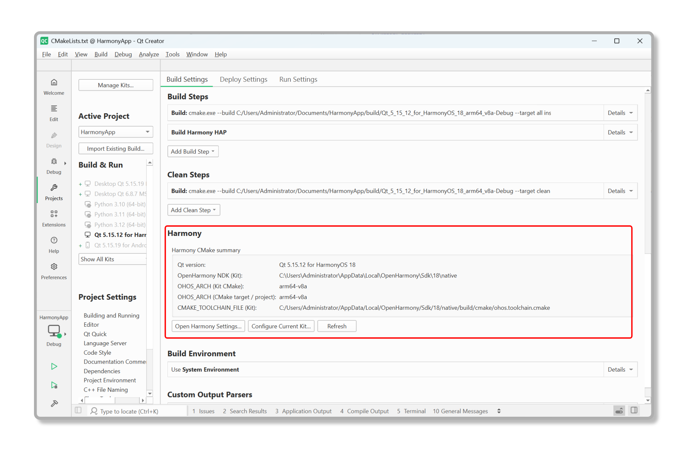

---

## 5. 编译 Qt for HarmonyOS 工程

编译分为两个阶段：**CMake 构建**（生成 native `.so`）和 **HAP 构建**（生成 `.hap` 包）。

### 5.1 构建步骤说明

在 **Projects → Build → Build Steps** 列表中，Harmony 工程包含：

| 步骤 | 说明 |
|------|------|
| **CMake Build** | 使用 OHOS Clang 工具链编译 C/C++ 代码，生成 `.so` |
| **Build HAP**（HarmonyBuildHapStep） | 依次执行：hvigor sync → ohpm install → hvigor assembleHap |

**Build HAP** 步骤配置项：

- **Target SDK version**：目标 API 版本（如 `20`）

- **Build tools version**：hvigor 版本（通常自动填充）

- **Module device types**：支持的设备类型（可选择跟随偏好/Kit，或单独覆盖）

- **Entry library name**：要加载的入口共享库文件名（如 `libentry.so`）。

  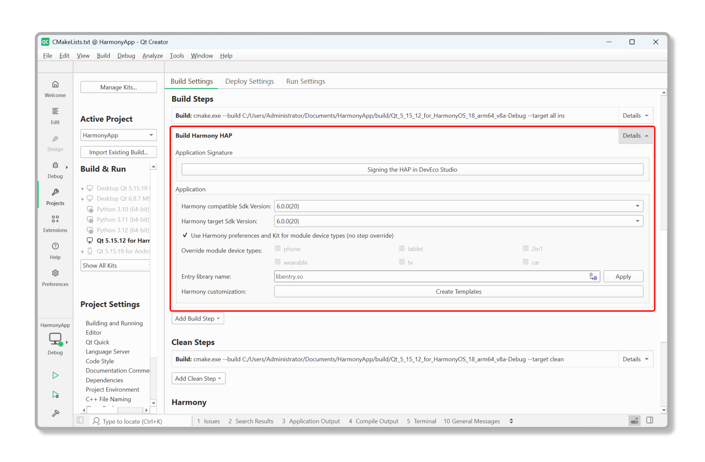

### 5.2 执行构建

1. 确认工具栏中已选择 **Harmony 相关 Kit**（而非 Desktop Kit）。

2. 点击 **Build → Build Project**，或使用快捷键 **Ctrl+B**（macOS：**⌘B**）。

3. 底部 **Compile Output** 面板实时显示构建输出：
   - hvigor sync：工程依赖同步进度
   
   - ohpm install：依赖安装日志
   
   - assembleHap：HAP 打包进度与产物路径
   
     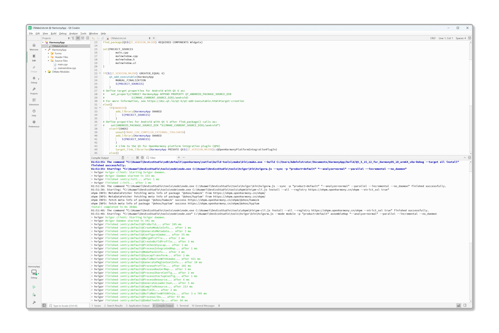

---

## 6. 签名、连接设备与部署

### 6.1 在 DevEco Studio 中进行自动签名

HarmonyOS 应用必须经过有效签名才能部署到真机。插件本身**不包含签名向导**，请在 DevEco Studio 中完成：

1. 用 DevEco Studio **打开同一个 HarmonyOS 工程**（`ohpro/` 目录，即包含 `AppScope/`、`entry/` 的目录）。
2. 进入 DevEco Studio 菜单：`Project → Signing Configs`（或 `Build → Generate Key and CSR`）。
3. 按提示完成**自动签名**配置（需华为开发者账号，使用 **Auto Sign**）：
   - DevEco Studio 自动申请调试证书并写入工程的 `build-profile.json5`
4. 在 DevEco Studio 中执行一次 **Build → Build HAP(s)/APP(s) → Build HAP(s)**，确认能生成带签名的 HAP。
5. 回到 Qt Creator，执行构建——插件的 `HarmonyBuildHapStep` 调用 hvigor 时会读取已配置的签名信息，生成有效签名的 HAP。

> 签名证书与 `build-profile.json5` 是工程级别配置，Qt Creator 插件尊重 DevEco Studio 配置的签名信息，无需重复配置。

### 6.2 连接 HarmonyOS 真机设备

1. 通过 **USB 数据线**将 HarmonyOS 真机连接到开发机。
2. 在设备上开启**开发者模式**与 **USB 调试**：
   - `设置 → 关于本机`：连续点击**版本号** 7 次启用开发者模式
   - `设置 → 开发者选项`：开启 **USB 调试**
3. 在终端中验证设备连接：
   ```bash
   hdc list targets
   ```
   输出示例：
   ```
   FMR0224XXXXXXXXX    USB
   ```
4. Qt Creator **Devices** 面板（`Tools → Options → Devices`）自动出现检测到的 HarmonyOS 设备，显示序列号、型号和 API 版本。

> **USB 热插拔**：插件通过 `usbmonitor` 自动检测设备连接/断开，无需手动刷新。也可点击设备面板的 **Refresh** 按钮主动触发（调用 `hdc list targets -v`）。

### 6.3 部署 HAP 包到目标设备

1. 在 Qt Creator 左下角的运行设备选择器中，选中已连接的 HarmonyOS 设备（而非 Desktop）。
2. 进入 **Projects → Run → Deploy** 页，确认 **Deploy Steps** 中包含 **Deploy to HarmonyOS Device**。
3. 点击 **Build → Deploy Project**，或使用运行按钮旁的下拉菜单选择 **Deploy**。
4. 插件的 `HarmonyDeployQtStep` 按以下优先级查找 HAP 并调用 `hdc install`：
   - 读取 `ohpro/build-profile.json5` 的 `modules[]`，拼接 `build/default/outputs/default/` 路径，优先 `type: entry` 模块
   - 再尝试经典路径 `entry/build/.../entry-default-signed.hap`
   - 最后在 ohpro 目录树内递归找最新的 `*.hap`
5. 部署日志在 **Compile Output** 面板实时显示。

#### 常见部署错误

| 错误字符串 | 含义 | 处理方式 |
|-----------|------|----------|
| `INSTALL_PARSE_FAILED_INCONSISTENT_CERTIFICATES` | 签名证书与设备上已安装版本不一致 | 先卸载旧版本，或使用相同证书重新签名 |
| `INSTALL_FAILED_UPDATE_INCOMPATIBLE` | 版本号不兼容 | 卸载旧版本后重新安装 |
| `INSTALL_FAILED_VERSION_DOWNGRADE` | 安装版本低于已安装版本 | 先卸载再安装，或提升版本号 |

遇到以上错误时，Qt Creator 会弹出对话框提示具体原因并提供操作选项（如**卸载后重新安装**）。

---

## 7. 应用运行

### 7.1 运行配置说明

点击工具栏运行配置下拉框，选择 **Harmony Application** 类型。配置界面（`Projects → Run`）提供以下选项：

| 配置项 | 说明 | 默认值 |
|--------|------|--------|
| **Bundle name override** | 覆盖自动检测的包名；为空时从 `AppScope/app.json5` 读取 | 空（自动） |
| **Ability name override** | 覆盖默认启动 Ability；为空时自动检测 `module.json5` 中 entry 模块的第一个 Ability | 空（自动） |
| **Ability assistant start arguments** | 附加传递给 `aa start` 的参数（高级用途） | 空 |
| **Pre-launch on-device shell commands** | 应用启动前在设备上执行的 shell 命令（多行） | 空 |
| **Post-quit on-device shell commands** | 应用退出后在设备上执行的 shell 命令（多行） | 空 |
| **Stream hilog to output panel** | 是否将设备 hilog 流式输出到应用输出面板 | **开启** |
| **hilog filter** | 追加到 `hilog -P <PID>` 命令的额外过滤参数 | 空 |
| **Enable startup breakpoints (aa start -D)** | 调试时使用 `aa start -D` 暂停 ArkTS VM | **开启** |

### 7.2 启动应用

1. 确认设备已连接、HAP 已部署（或同时执行部署+运行）。
2. 点击工具栏 **▶ 运行按钮**（快捷键 **Ctrl+R** / macOS **⌘R**）。
3. 插件通过 hdc daemon Socket 长连接（`HarmonyMainRunSocketTask`）执行：
   - 向设备发送 `aa start -b <bundle> -a <ability>` 命令
   - 保持连接监测应用状态
   - 可选：同步启动 hilog 流式读取（自动以应用 PID 过滤）
4. 应用成功启动后，底部 **Application Output** 面板显示运行状态信息。
5. 点击 **■ 停止按钮** 终止应用：插件发送 `aa force-stop <bundle>`，之后执行 Post-quit 命令（若已配置）。

---

## 8. 应用日志查看

### 8.1 实时日志流

应用运行时，若 **Stream hilog to output panel** 已开启（默认开启），插件自动以应用 PID 为过滤条件，通过 hdc daemon Socket 长连接将设备日志实时推送到 **Application Output** 面板。

日志行按严重级别自动着色：

| hilog 级别 | 面板显示颜色 |
|-----------|-------------|
| `D`（Debug） | 默认前景色（不突出） |
| `I`（Info） | 默认前景色（正常可读） |
| `W`（Warning） | 黄色 / 橙色 |
| `E`（Error）/ `F`（Fatal） | 红色 |

> **hilog 典型行格式**：`MM-DD HH:MM:SS.mmm  <PID>  <TID> <Level> <domain>/<Tag>: <message>`

### 8.2 关键字过滤查看

在运行配置的 **hilog filter** 字段中，填入额外过滤参数（追加到 `hilog -P <PID>` 命令后）：

| 过滤示例 | 说明 |
|----------|------|
| `-T MyTag` | 仅显示 Tag 为 `MyTag` 的日志 |
| `-e somePattern` | 仅显示匹配正则表达式 `somePattern` 的日志行 |
| `-L W` | 仅显示 Warning 及以上级别 |
| `-D 0xD001234` | 仅显示特定 Domain 的日志 |
| `-T MyTag -L E` | 组合：特定 Tag + Error 级别 |

**操作步骤**：

1. 在 **Projects → Run** 页找到 **hilog filter** 输入框。
2. 填入所需过滤参数，例如 `-T [MY_APP] -L W`。
3. 点击运行，**Application Output** 面板只显示满足条件的日志行。

也可在 Application Output 面板内使用 Qt Creator 自带的**搜索框**（**Ctrl+F**）对已有日志内容进行实时文本搜索。

---

## 9. 调试 Qt for HarmonyOS 应用

插件实现了完整的 **Native LLDB 调试**支持（`HarmonyDebugWorkerFactory`），支持 C/C++ 代码断点调试与变量查看。

### 9.1 前提条件

| 条件 | 说明 |
|------|------|
| **Debug HAP** | 必须是 **debug 构建变体**（含 DWARF 调试信息，`.so` 未 strip） |
| **设备** | 普通零售真机或开发者镜像均可；需开启开发者模式与 USB 调试 |
| **DevEco SDK** | 插件从 DevEco SDK 路径自动定位 `lldb-server`（路径：`<DevEco>/sdk/default/openharmony/native/llvm/lib/clang/<ver>/bin/<triple>/lldb-server`） |
| **`arktsdebugbridge`** | startup-break 模式所需，位于 Qt Creator 可执行文件同级的 `libexec/arktsdebugbridge` |

> **关于 Debug HAP**：确保使用 DevEco Studio Debug 变体（`build-profile.json5` 中 `buildMode: "debug"`）签名安装，才能获得完整 native 调试体验。Release HAP 的 `.so` 通常已 strip，LLDB 无法解析符号。

### 9.2 启动调试会话

1. 将工程**构建类型**切换为 **Debug**（Projects 页 → Build Settings → Build type: Debug）。
2. 在代码编辑器中，点击行号左侧设置**断点**（红点标记）。
3. 确认设备已连接，Debug HAP 已部署。
4. 点击工具栏**🐛 调试按钮**（**F5** / macOS **Fn+F5**）。
5. **Application Output** 面板逐步显示调试准备进度：

```
Harmony DAP debug: preparing…
Harmony DAP debug: step 1 — force stop
Harmony DAP debug: step 2 — prepare remote dir
Harmony DAP debug: step 3 — push lldb-server
Harmony DAP debug: lldb-server pushed from: /path/to/lldb-server
Harmony DAP debug: step 4 — aa start -D (startup-break mode)
Harmony DAP debug: step 5 — poll app PID
Harmony DAP debug: app PID 12345.
Harmony DAP debug: step 5b — ArkTS port-forward + bridge
Harmony DAP debug: bridge started (PID 67890), connecting to ws://127.0.0.1:xxxxx…
Harmony DAP debug: step 6 — inject lldb-server
Harmony DAP debug: lldb-server confirmed (attempt 3): …
Harmony DAP debug: connecting — socket=unix-abstract-connect://[FMRxxxx]/com.example.app/platform-xxx.sock
```

### 9.3 断点命中与变量值查看

断点命中后程序在该行**暂停**，Qt Creator 进入调试模式：

| 面板 / 区域 | 功能 |
|------------|------|
| **代码编辑器** | 黄色箭头 `→` 指示当前执行行；红点为断点 |
| **Stack（调用堆栈）** | 显示当前线程的函数调用链，点击可切换栈帧 |
| **Locals & Expressions（局部变量）** | 实时显示当前作用域内变量的名称、类型与值；支持展开结构体/指针；Qt 类型（`QString`、`QVector` 等）有友好格式显示 |
| **Breakpoints（断点管理）** | 查看、启用/禁用、删除断点；支持条件断点 |
| **Debugger Console** | 直接输入 LLDB 命令（如 `expr`、`po`、`bt`） |

**变量查看操作**：

1. 断点命中后，**Locals & Expressions** 面板自动展示：
   - 函数参数（`this`、各参数变量）
   - 局部变量（基本类型直接显示值；指针显示地址与解引用值）
2. 鼠标悬停在编辑器中的变量名上，弹出当前值的**工具提示**。
3. 在 **Expressions** 子标签手动输入表达式（如 `myVector.size()`、`*ptr`）求值。

**调试控制快捷键**：

| 操作 | 快捷键（Windows/Linux） | 快捷键（macOS） |
|------|------------------------|-----------------|
| Continue（继续） | **F5** | **Fn+F5** |
| Step Over（单步，不进入） | **F10** | **Fn+F10** |
| Step Into（单步进入） | **F11** | **Fn+F11** |
| Step Out（跳出当前函数） | **Shift+F11** | **Shift+Fn+F11** |
| Stop（停止调试） | **Shift+F5** | **Shift+Fn+F5** |

### 9.4 Solib 搜索路径

插件自动设置 LLDB 的 solib 搜索路径，优先在以下位置查找调试符号：

1. `<构建目录>/ohpro/entry/build/default/intermediates/cmake/default/obj/arm64-v8a/`（含完整 DWARF 的 cmake 中间产物）
2. `<构建目录>/ohpro/entry/build/default/intermediates/libs/default/arm64-v8a/`
3. `<构建目录>/`（CMake build 输出根目录）

> 若断点命中但行号偏移，通常是 LLDB 加载了 strip 后的 `.so`。可用 `llvm-objdump --debug-info <xx.so>` 确认文件是否包含调试节。

### 9.5 关于 startup-break 模式

运行配置中的 **Enable startup breakpoints (aa start -D)**（默认开启）控制是否使用 ArkTS 启动暂停：

- **开启**：使用 `aa start -D`，ArkTS/JS VM 在启动时暂停，允许在 C++ 初始化代码处（`main()`、全局构造函数等）设置断点；同时启动 `arktsdebugbridge` 解除 ArkTS 等待
- **关闭**：使用普通 `aa start`，适用于只需在运行途中设置断点的场景

> 若 `arktsdebugbridge` 不存在，Application Output 面板会显示警告，但 C++ Native 断点仍然有效。

---

## 附录：常见问题（FAQ）

| 现象 | 建议 |
|------|------|
| 插件加载后 Harmony 设置页不见 | 进入 `Help → About Plugins…` 确认 Harmony 插件为 **Loaded**；主版本不匹配时加载失败 |
| Kit 自动注册后看不到 | 进入 `Tools → Options → Kits` 检查；也可在 Harmony 设置页移除并重新添加 SDK/qmake 手动触发 |
| `hdc list targets` 找不到命令 | 确认 SDK 已配置；插件从 `<SDK>/toolchains/hdc` 查找 hdc |
| 调试提示 `lldb-server not found` | 确认 DevEco Studio 路径正确，且 `sdk/default/openharmony/native/llvm/` 目录存在 |
| 断点不命中，只显示汇编 | 确认 HAP 是 debug 构建且 `.so` 未 strip；构建时使用 `CMAKE_BUILD_TYPE=Debug` |
| 应用日志不显示 | 确认运行配置中 **Stream hilog** 已开启；可在设备手动执行 `hdc shell hilog -P <pid>` 验证 |
| hvigor / ohpm 报找不到 Node | 检查 DevEco Studio 路径；或确认系统 `PATH` 中有 `node` 可执行文件 |

---

> **更多参考**：
> - 外部依赖与构建管线细节：[OPERATIONS.md](OPERATIONS.md)
> - Native 调试详细步骤与官方文档指引：[HARMONY-LLDB-DEBUG.md](HARMONY-LLDB-DEBUG.md)
> - 功能完成状态：[COMPARISON-PROGRESS.md](COMPARISON-PROGRESS.md)
> - 版本与兼容策略：[VERSIONING.md](../VERSIONING.md)